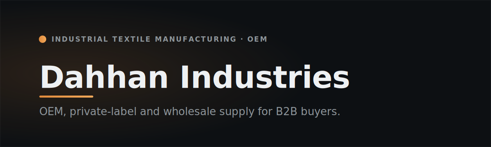

  

  
  
  

# Dahhan Industries

> **Industrial textile manufacturing, OEM, private‑label and wholesale supply — for B2B buyers.**

Dahhan Industries is the industrial textile manufacturing, OEM, private‑label, and wholesale‑supply company within the Dahhan business ecosystem. It serves B2B buyers, procurement teams, OEM and private‑label brands, distributors, and trade partners as a **capability‑first manufacturer and wholesaler**.

The site exists to establish Industries as a credible, export‑ready manufacturer and to route qualified enquiries to the right team. It is not a fashion brand, a direct‑to‑consumer store, or a storefront.

## Who we serve

- Wholesale buyers, distributors and trade partners
- OEM and private‑label brands
- Procurement and supply‑chain teams

## How we work

A clear, standard production flow — from first enquiry to shipment:

**Inquiry & specification → Sampling → Bulk production → Quality control → Shipment**

MOQ, lead times, Incoterms and payment terms are confirmed per inquiry and shared on request. Capability, specification, and compliance details are published as they are verified — we show what is current and provable, and never pad the record.

## Tech stack

  
  
  
  
  
  
  
  

Next.js 16 (App Router, RSC) · React 19 · TypeScript 6 · Tailwind CSS v4 · Framer Motion · Directus CMS · multilingual (EN / TR / AR, RTL) · accessibility-tested (Playwright + axe) · self-hosted behind Caddy + Cloudflare. Industrial, factual, spec-first design.

## Links

- 🌐 **Live:** [www.dahhanindustries.com](https://www.dahhanindustries.com) &nbsp;·&nbsp; 🟡 *Launching soon*
- 🏛️ **Group on GitHub:** [M1D0-Technologies](https://github.com/M1D0-Technologies)
- 🧵 **Group parent:** [Dahhan Enterprises](https://github.com/M1D0-Technologies/dahhan-enterprises)
- ✉️ **Enquiries:** info@dahhanindustries.com

---

An operating brand of the **Dahhan Enterprises** group · built and operated by **M1D0 Technologies**. Documentation-only showcase — product source is private. © 2026 Dahhan Enterprises LLC — M1D0 Technologies, Dahhan Industries, Miss Dantella and affiliated brands. All rights reserved.
